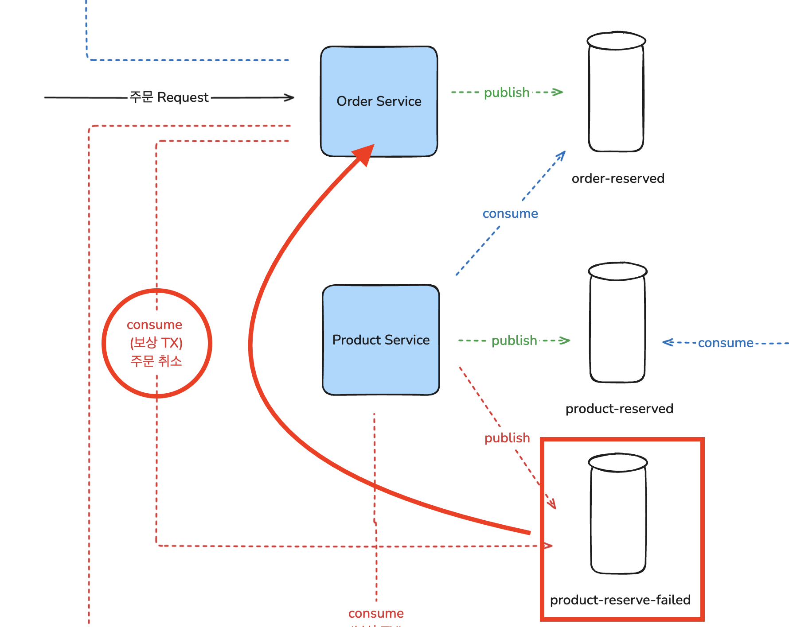

# 이커머스 서비스 with MSA

## Services
- User Service
- Order Service
- Product Service
- Payment Service

## 이커머스 (주문 - 결제) 아키텍처

---

## Choreography SAGA
- 여러 분산 환경의 트랜잭션 보장 방법(2pc, saga)에 대해 이해하고 현재 아키텍처에 가장 적합하다고 판단되는 Choreography based SAGA 패턴을 적용하였습니다.

---

## Redis Single Node Distributed Lock (Redisson)
- 재고차감, 결제 등의 서비스에서 race condition 문제가 발생하였습니다.
- 동시성 핸들링 방법으로 Redis를 활용한 분산락을 선택하였고, 스프링 AOP를 적용하여 선언적으로 분산락을 적용할 수 있도록 구현하였습니다.

---

## CQRS 패턴 적용
- Product Service의 상품 도메인의 명령모델과 조회모델을 분리하였습니다.
- 상품 정보 생성, 수정 요청이나 이벤트 발생시 핸들링하여 비동기적으로 조회모델을 생성하여 MongoDB에 저장합니다.
- 서비스 유휴기간에 Full Batch를 하여 모든 상품 정보를 읽기저장소에 UpSert합니다.

