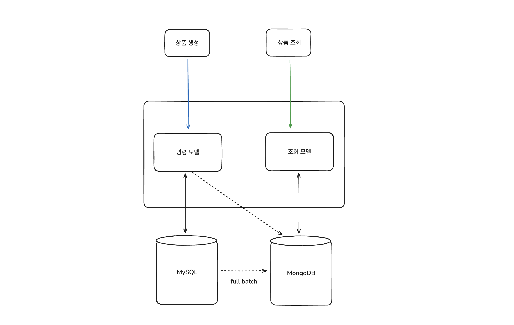

# 이커머스 서비스 with MSA

## Services
- User Service
- Order Service
- Product Service
- Payment Service

## 이커머스 (주문 - 결제) 아키텍처

---

## CQRS
- Product Service의 상품 도메인의 명령모델과 조회모델을 분리하였습니다.
- 상품 정보 생성, 수정 요청이나 이벤트 발생시 핸들링하여 비동기적으로 조회모델을 생성하여 DocumentDB(MongoDB)에 저장합니다.
- 서비스 유휴기간에 Full Batch를 하여 모든 상품 정보를 읽기저장소에 UpSert합니다.

